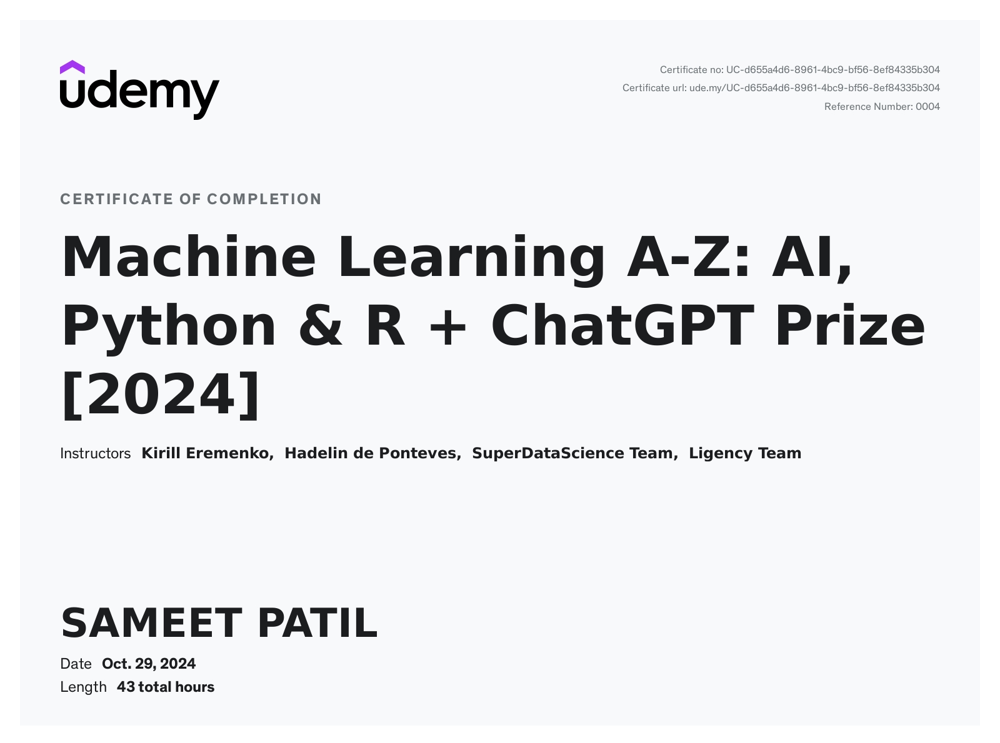

# 🤖 Machine Learning A-Z™ - Hands-On Python & R Projects 🚀  

🌟 Welcome to my repository showcasing projects from the **[Machine Learning A-Z™: Hands-On Python & R In Data Science](https://www.udemy.com/course/machinelearning/)** course by **Kirill Eremenko** and **Hadelin de Ponteves** on _Udemy_!  

This course was an incredible journey into the world of machine learning, offering both theoretical understanding and practical applications.  

---

## 🎯 **Course Topics and Projects**  

✅ **Data Preprocessing**  
✅ **Regression**: Simple, Multiple, Polynomial, SVR, Decision Tree, Random Forest  
✅ **Classification**: Logistic Regression, KNN, SVM, Naive Bayes, Decision Trees  
✅ **Clustering**: K-Means, Hierarchical Clustering  
✅ **Association Rule Learning**: Apriori, Eclat  
✅ **Natural Language Processing (NLP)**  
✅ **Deep Learning**: ANN, CNN, RNN  
✅ **Reinforcement Learning**: Thompson Sampling, UCB  
✅ **Dimensionality Reduction**: PCA, LDA, Kernel PCA  
✅ **Model Selection and Boosting**: XGBoost  

Each topic includes hands-on projects implemented using **Python** and real-world based datasets, reinforcing theoretical concepts with practical applications.  

---

## 📂 **Repository Structure**  

This repository contains Python implementations for all the topics and algorithms covered in the course.  

```plaintext
📁 Association-Rule-Learning/
📁 Classification/
📁 Clustering/
📁 Data-Preprocessing/
📁 Deep-Learning/
📁 Dimensionality-Reduction/
📁 Model-Selection-and-Boosting/
📁 Natural-Language-Processing/
📁 Regression/
📁 Reinforcement-Learning/
📄 certificate.png
📄 README.md
```

---

## 🛠️ How to Run the Projects

Clone this repository:

```bash
git clone https://github.com/sameetpatil5/machine-learning-projects.git
cd machine-learning-projects/
```

Navigate to the desired project folder:

```bash
cd Regression/Simple Linear Regression/simple_linear_regression.ipynb
```

Run the notebook.

---

## 🎉 Completion Certificate

  
> Proud to have completed this journey and earned the certificate of completion! 🏆

---

## 🤝 Acknowledgments

A huge thanks to [Kirill Eremenko](https://www.linkedin.com/in/keremenko/) and [Hadelin de Ponteves](https://www.linkedin.com/in/hadelin-de-ponteves-hon-phd-1425ba5b/) for their intuitive teaching and comprehensive curriculum.

---

## 📢 **Connect with Me**

If you liked this repository, feel free to reach out!  
💼 [LinkedIn](https://www.linkedin.com/in/sameetpatil5/)  
✍️ [Medium](https://medium.com/@sameetpatil5)  
🐦 [Twitter](https://x.com/SAMEETPATIL5)  

---

_*#Python #ArtificialIntelligence #MachineLearning #DataScience #Udemy #DataPreprocessing*_
